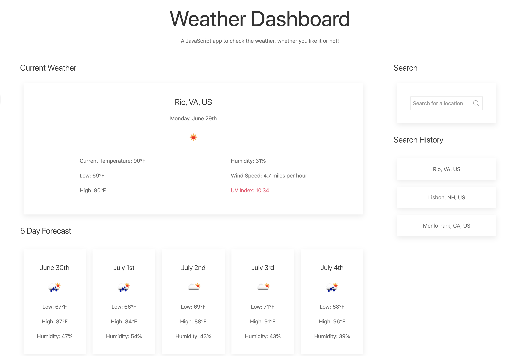

# Weather Dashboard
https://vanessalane.github.io/weather-dashboard/

## Description
A vanilla JS app to check the current weather and forecast.

## APIs/Frameworks
- [OpenWeatherMap](https://rapidapi.com/community/api/open-weather-map)
- [UI Kit](https://getuikit.com/)

## User Story
As a traveler, I want tot see the weather outlook for multiple cities so that I can plan a trip accordingly.

## Questions
If you have questions, email me at [vlane0593@gmail.com](mailto:vlane0593@gmail.com) or reach out on [GitHub](https://www.github.com/vanessalane)

## Screenshot

